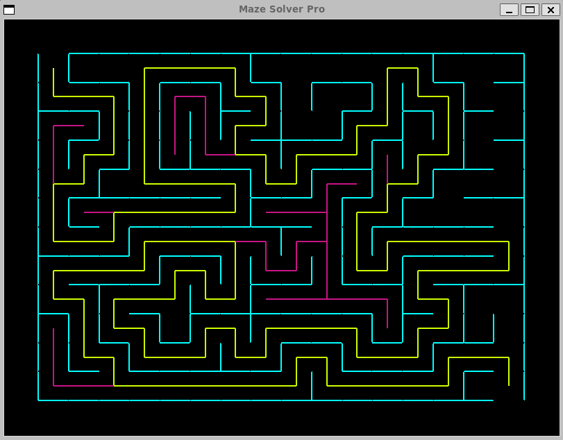

# Maze-Solver

A Python-based maze generator and solver with a graphical user interface. This program creates random mazes and demonstrates pathfinding algorithms to solve them.

## Screenshot



*The program generates random mazes and visualizes the solving process with different colors showing the path exploration.*

## Features

- Generates random mazes using a recursive backtracking algorithm
- Visualizes maze generation and solving process in real-time
- Solves mazes using a recursive depth-first search algorithm
- Customizable maze dimensions and cell sizes
- Interactive graphical interface built with Tkinter

## Requirements

- Python 3.x
- Tkinter (usually comes with Python installation)

## Installation

1. Clone this repository:
```bash
git clone https://github.com/frozendolphin/Maze-Solver.git
cd Maze-Solver
```

2. Install the required dependencies:
```bash
pip install -r requirements.txt
```

## Usage

Run the program using:
```bash
python main.py
```

The program will:
1. Generate a random maze
2. Display the maze generation process
3. Attempt to solve the maze
4. Show the solution path if one exists

## Customization

You can modify the following parameters in `main.py`:
- `num_rows`: Number of rows in the maze
- `num_cols`: Number of columns in the maze
- `margin`: Margin size around the maze
- `screen_x`: Window width
- `screen_y`: Window height

## Project Structure

- `main.py`: Entry point of the program
- `maze.py`: Contains the Maze class for generation and solving
- `cell.py`: Defines the Cell class for maze cells
- `window.py`: Handles the graphical interface
- `tests.py`: Contains test cases for the program

## License

This project is open source and available under the MIT License.
